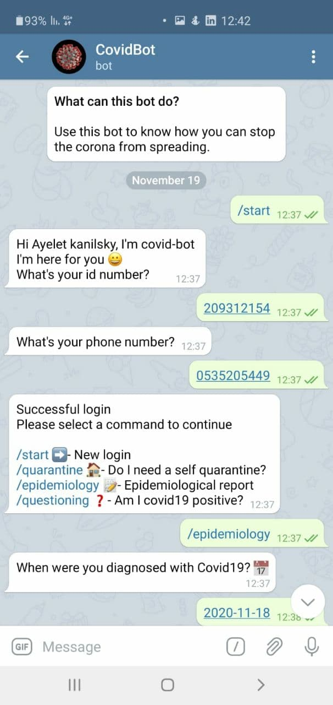

# Ecxellenteam Mid Hackathon Telegrambot
## Team members:
### * Yeal Rubin
### * Ayelet Weinstock
### * Avigail Abragel
## What does the bot do?
### 1. Corona Epidemiological report 
### 2. Checks whether the person has been in contact with verified patient in Corona (by location date and time).
### 3. Advises the person whether to do a corona test for symtoms
## Libraries/Technologies Used:
### * python 3.7
### * Nominatim
### * sql
### * geopy
### * Flask
### * bot
##Example:

